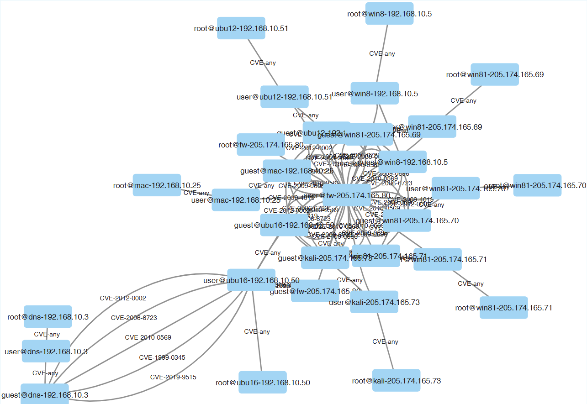

# **Attack Graph-Integrated Intrusion Detection System Prototype**

---

## Abstract

Cyber attack detection and response is complex due to high-volume, intricate network traffic that facilitates concealed attacks.
While Intrusion Detection Systems (IDSs) identify anomalous network behaviors, Attack Graphs (AGs) are the premier threat model for analyzing attacker strategies and informing response.
Despite the conceptual connection being recognized in early research, the field of AG and IDS integration lacks a common structure.
This paper provides the first systematic analysis of these efforts, reviewing **73** works.
Our novel taxonomy reveals the literature is dominated by specialized, single-purpose integrations---for instance, using AGs to reduce IDS false positives, or IDS alerts to prune AGs.
The analysis highlights the absence of a unifying framework that addresses the combined limitations of IDSs and AGs as an integrated system.
To bridge this gap, we propose a novel AG-IDS lifecycle.
This formalizes a process where IDSs refine AG models, and those updated AGs subsequently improve IDS detection.
We present a proof-of-concept implementation of this lifecycle, demonstrating its advantages for detection and response.

This project addresses that gap by:

- Reviewing **73** relevant works
- Proposing a novel **taxonomy** of IDS–AG integration:
  - **AG-based IDS refinement**
  - **AG-integrated IDSs**
  - **IDS-based AG generation**
  - **Hybrid approaches**

Our findings reveal that most current methods rely on static assumptions, overlooking the dynamic and evolving nature of real-world threats. To address this, we introduce a new **IDS–AG lifecycle** that supports continuous detection and response. We also provide a simple prototype implementation to demonstrate its benefits and highlight future directions for adaptive and resilient network security.

---

## Project Structure

```plaintext
main.py
├── buildIDSnet.py
├── attackgraph/
│   └── agBuilder.py
├── ids/
│   └── run_all.py
├── data/
│   ├── networks/
│   ├── vulns.json
│   ├── vulnsAttack.json
│   ├── TrafficLabelling/
│   └── emerging_rules/
└── results/
```

The folder `attackgraph` includes all the files for the AG generation simulations; the folder `ids` includes all the files for the AG-integrated IDS and IDS refinement simultations; the folder `data` includes all the datasets; the folder `results` reports the results for reproducibility.

## Requirements

- Python 3.x
- JSON files with network and vulnerability data
- Pre-downloaded NVD datasets and Snort rules

## Pipeline Overview

### 1. Dataset Preprocessing

- Prepare initial network topology from `CiC17Net.json` using:
  - `internal_net()`: internal mapping of original topology.
  - `get_dump_nvd()`: downloads and stores NVD vulnerabilities in `vulns.json`.
  - `getVulnsByService("ubu16")`: filters CVEs for Ubuntu 16.
  - `generate_devices()`: generates device profiles with attached vulnerabilities.

### 2. Rule-Based Vulnerability Mapping

- Uses `get_dump_cveList()` to extract CVEs from emerging Snort rules.
- Generates `vulnsAttack.json` representing attack-based vulnerabilities.
- Applies `getVulnsByAlert()` to refine network inventories based on alert traces.

### 3. Attack Graph Generation

For each network variant:

- `build_multiag()`: builds attack graph and outputs `.graphml` file.
- `compute_paths()`: identifies exploitation paths from sources (e.g., `kali`, `fw`, `win81`) to defined goals.
- `plot_risk()`: visualizes network-wide risk exposure using likelihood metrics.

### 4. AG-Integrated IDS Execution

- Runs IDS simulations via:
  - `run_all_blue_box()`: baseline evaluation.
  - `run_all_blue_box_parallel()`: parallelized attack scenarios.
  - `run_all_blue_box_controlled()`: controlled IDS benchmarks.

### 5. AG-Based IDS Refinement

- Applies AG feedback loops for enhanced rule triggering and reduction of false positives:
  - `run_all_orange_box()`
  - `run_all_orange_box_parallel()`
  - `run_all_orange_box_controlled()`

## How to Run

```bash
python main.py

```

## Case Study



This repository contains a proof-of-concept implementation of the proposed Attack Graph–Intrusion Detection System (AG–IDS) integration lifecycle. The case study uses the CIC-IDS2017 and CIC-DDoS2019 datasets to evaluate how IDS alerts can generate and refine attack graphs, and how updated graph knowledge can improve subsequent intrusion detection.

The implementation evaluates multiple classifiers, including Decision Trees, Random Forests, Multilayer Perceptrons, Support Vector Machines, and Gaussian Naive Bayes. It investigates the effects of attack-graph quality, training-data availability, feature selection, and iterative graph refinement on detection accuracy, macro-averaged F1-score, and false-positive rate.

This implementation is intended as an illustrative proof of concept rather than a production-ready detection system. It demonstrates the main lifecycle stages and their interactions while leaving large-scale deployment, real-time graph processing, and richer graph representations for future work.
